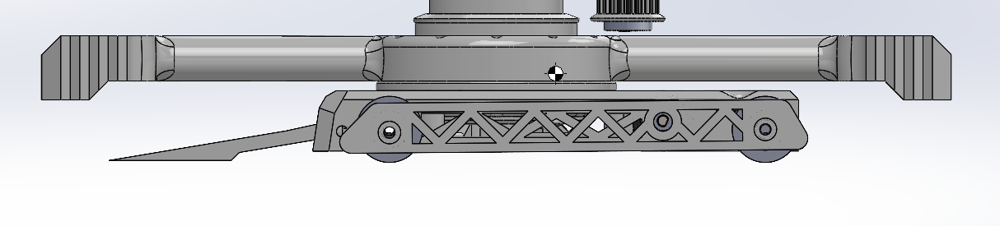
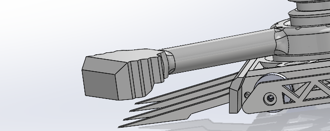
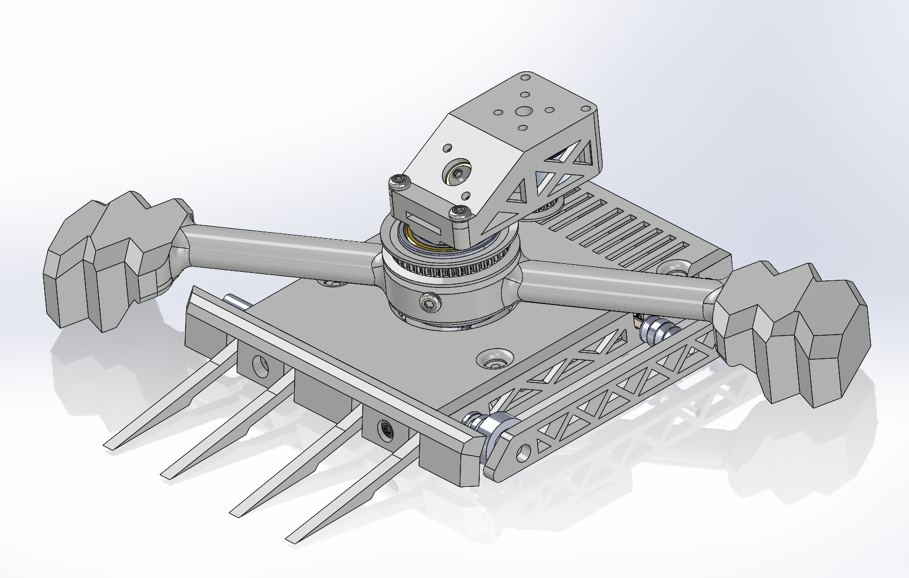
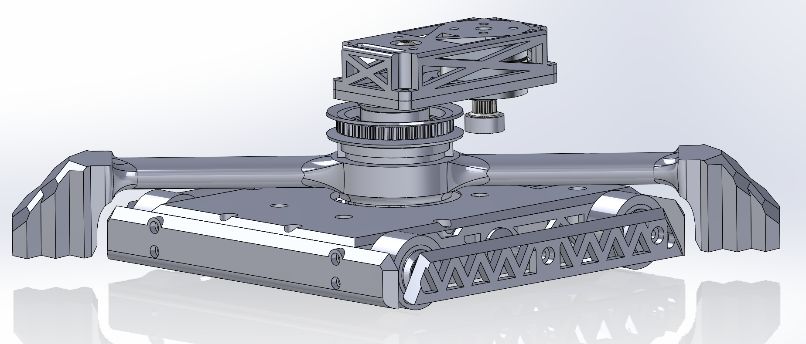
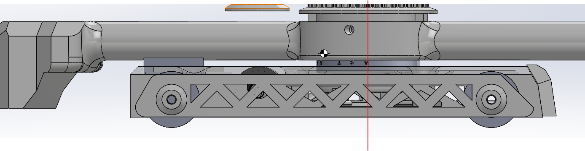
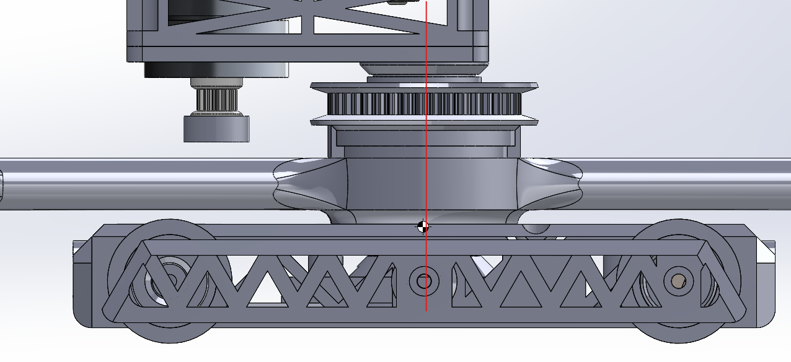
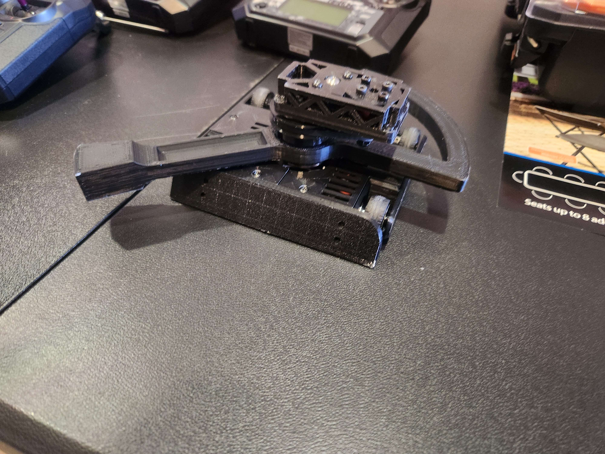
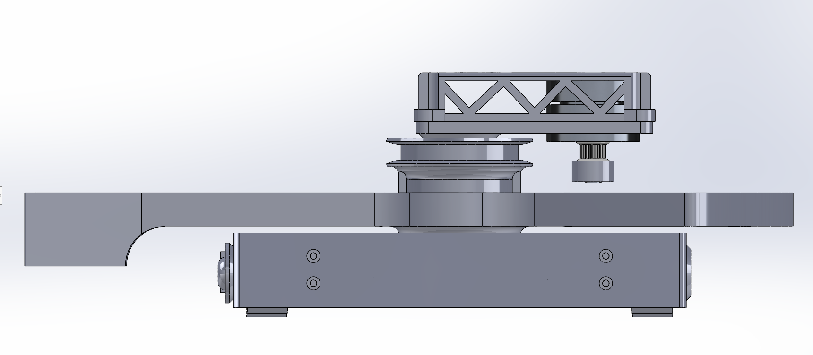
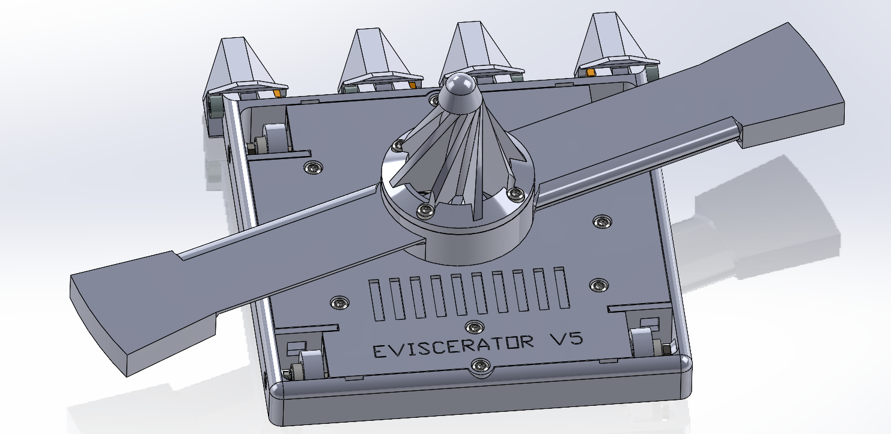
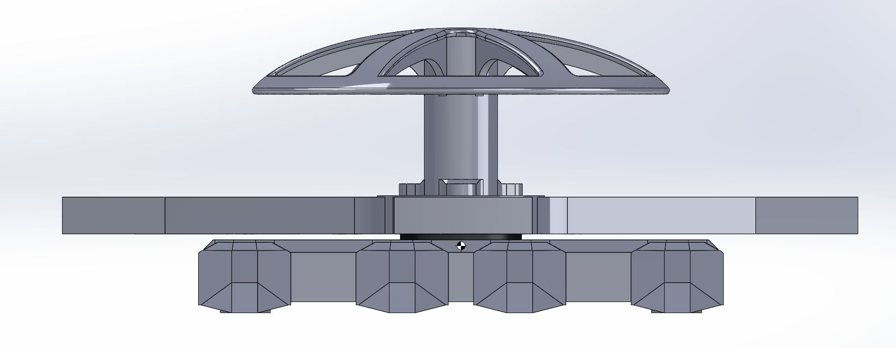

# Eviscerator

([back to main page](../README.md))
### Current Version brief overview:
- Overhead spinner w/4WD
- ~9in diameter 120g weapon
- Weapon motor: 1300KV 2806.5 brushless
- Drive consists of 4 1000RPM N20 motors

---

Final version that won 1st at Texas Robot Combat (TRC) Texas Cup 2024 Plastic Antweight Division:

Note: This was a late/final version of V7 which went on to win in the rematch vs Double Stuff after losing in a prior competition

Results of my match with Bucktoof (Bucktoof pictured below) which colored the ends of my weapon red:

Design Journey
---
**Version 0:**
---

I initially based my design on Icewave from BattleBots and knew a few key features it needed to have: a low center of mass and a wide, flat base. To achieve this, I attempted to move the weapon motor above the weapon and implemented a reduction to provide the motor with sufficient torque.

---
**Version 1:**
---

I thought I could save weight by using a 3D-printed bearing instead of a metal one and dived straight into CAD tutorials. I later realized this was a mistake, but it helped me improve my ability to work with assemblies. The bearing I was trying to make was a slew bearing, but due to various factors, including tolerances and print imperfections, it only functioned well when not under heavy load.

---
**Version 2:**
---

I mainly experimented with the design, trying to optimize it, improve the drive performance, and create an effective weapon system. I faced three main issues: the round belts I used for the drive either slipped excessively or had too much tension, the bot flipped itself over when spinning up, and it was incapable of self-righting. Additionally, the night before one of my early competitions, the bot essentially destroyed itself due to an insufficiently strong chassis. I believe it was V4 that exploded, but I don’t remember exactly. Switching to a large-diameter metal bearing added weight but was ultimately lighter than the 3D-printed abomination I had been designing. In the end, it worked great.

<!--  -->
<!--  -->

---
**Version 3:**
---

Due to belt slippage and the tiny tires, the bot was very slow. To make matters worse, I still had not fixed the spontaneous self-flipping issue. That was when I began learning about the Intermediate Axis Theorem, which explained why the bot was flipping, but it took me a long time to fully understand it and resolve the problem. I attempted to implement 'wings' to increase the moment of inertia (MOI) along the axis horizontally perpendicular to the main weapon axis. However, I later realized that I had misread the MOI values by a decimal place, leading me to falsely believe I had achieved a stable ratio. 

---
**Version 4:**
---

This was where things started to click. I had given up on the belts and made sure that I could at least drive upside-down to be able to continue the match. Prior to this most of matches went like this:

-> I spun up my weapon

-> I hit my opponent one time

-> I flip over

-> I get stuck and get counted out

So being able to stay in the match was a huge improvement, however my new weapon geometry was highly unfavorable for self-righting with my smaller brushless motor and the pulley on the weapon motor tended to melt away. Nonetheless, this was a major improvement in many facets. 

---
**Version 5:**
---

My biggest failure. In many ways, it was an upgrade in design but a major step back in performance. In its first competition, I had to use a substitute motor that lacked sufficient torque. The weapon was also poorly designed when analyzed using the Intermediate Axis Theorem, resulting in very short matches that I lost. The cone did not help with self-righting at all, partly due to my terrible weapon geometry. I attempted to experiment with aerodynamics, but for various reasons, the benefits were negligible. The only positive aspect of this design was that I had converted to a monolithic chassis with four small N20 motors. This not only provided four-wheel drive and better steering but also significantly improved durability.

---
**Version 6:**
---

It was at this point that I reached the cusp of true competitive viability. There were major issues, but they simply became areas for improvement. To start, I began learning about the importance of design adaptability for facing specific opponents—a wedge for horizontal spinners and forks for vertical spinners and wedges. A tri-blade weapon design provided high stability, and the new, more powerful motor had nearly double the torque. Around this time, I also switched from using a single 3S Lithium Polymer (LiPo) battery to two 4S LiPo batteries in series to achieve a higher output voltage. A large dome on top allowed the bot to roll over due to an intentionally offset center of mass (COM). However, the initial dome design did not work. Although not pictured, it was shrunk down and adjusted before the competition to enable consistent self-righting.

I had also identified an issue with the N20 drive motors. The large gears within their gearboxes protruded by a fraction of a millimeter, and when they rubbed against the walls retaining them within the chassis, the motors would bind. The screws holding the forks also tended to work themselves loose and were extremely difficult to install and tighten. Additionally, when self-righting, the chassis would spin instead of the weapon, which was necessary to create the instability required for rocking and self-righting using the dome. However, the chassis frequently hitting the ground often caused the forks to break near the edges.

Since I did not have a wedge and my dome would pop off upon impact (breaking at the layer lines just above where it mounted to the weapon and detaching like an umbrella), I lost a match to a strong competitor who placed in the top three. That bot was a horizontal ring spinner named Double Stuff. That match was important because it highlighted my bot’s newfound stability and improved performance. Despite this, I ultimately lost all of my matches. 

---
**Version 7:**
---

This marked the start of my victories. V7 got many things right. It redesigned the weapon after it broke by re-optimizing the end geometry and addressing the weapon cracking issues around the base and hub. The forks and wedge used an entirely new mounting system—no more screws. Instead, a steel rod slid into the front of the monolithic chassis and was retained by a set of shaft collars. The angles of both were limited by the chassis wall behind them to prevent damage when bouncing around. The top plate was divided into segments for easy battery access and maintenance, and the overheating issues that plagued the previous version, causing it to melt through the chassis within 1-2 matches, were also addressed.

The overheating issue took a while to pinpoint, but it was ultimately determined that limiting the motor output was necessary to achieve a reasonable weapon tip speed. This speed was carefully calculated based on the motor efficiency and data sheet specifications to determine the optimal KV and operating percentage of throttle. Running at full speed resulted in the weapon literally disintegrating due to excessive forces. By limiting the output, I was able to keep the motor relatively cool even in longer matches and ensured there was no excessive battery drain.
 
The dome print orientation was modified to prevent the shearing issue. No matter the design, print temperature, or structure, the dome would continuously shear horizontally. The dome was also repurposed as a weapon hub to which the weapon mounted, and it was optimized for the tri-blade weapon design. Since my weapon only spun in one direction, the design was made with that in mind, allowing for easier optimization of weight. Additionally, slots were added within the chassis to ensure the drive motor gearboxes were unimpeded, preventing them from rubbing on their retaining walls.

In my matches at the competition (North Texas Bot Battles; NTBB) prior to TRC's Texas Cup, I experienced many small issues, including but not limited to: drive ESC burnout/failure, top plate layer splitting which resulted in weapon operation failure, mounting post/structural integrity issues, and weapon cracking (which was addressed afterward, but not before the competition).

Weapon broken during testing:

Pre-competition design (early V7):

V7 brought Eviscerator to gain a 2nd place finish at NTBB followed by a 6-0 victory at the TRC Texas Cup 2024. 

---
**Version 8:**
---

Still in development. Many small changes were made following an unsatisying loss at NTBB early in 2025. 

The weapon hub has been optimized by printing the dome and hub as two separate pieces to maximize their individual strength. The chassis experienced numerous mounting point failures after nearly 10 matches of endurance, resulting in a complete failure. The weapon motor had a magnet break off the magnet ring, and from now on, the motor will be battle-hardened (the magnet ring will be epoxied to exponentially improve its strength and durability). The weapon geometry is also being refined to further improve the weapon’s ability to bite into opponents when driving at lower speeds. This bot is serving as the prototype for an in-development Antweight version, with plans to return to competitions in the near future.
 
([back to top](#current-version-brief-overview))
