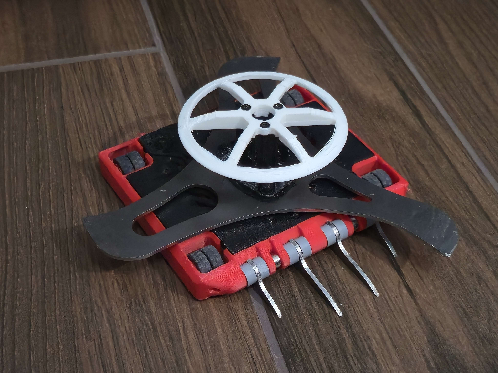
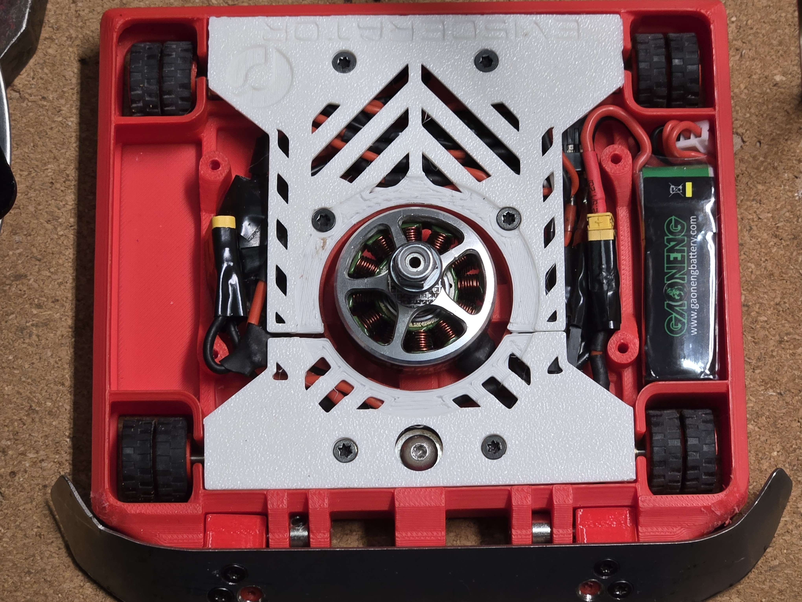
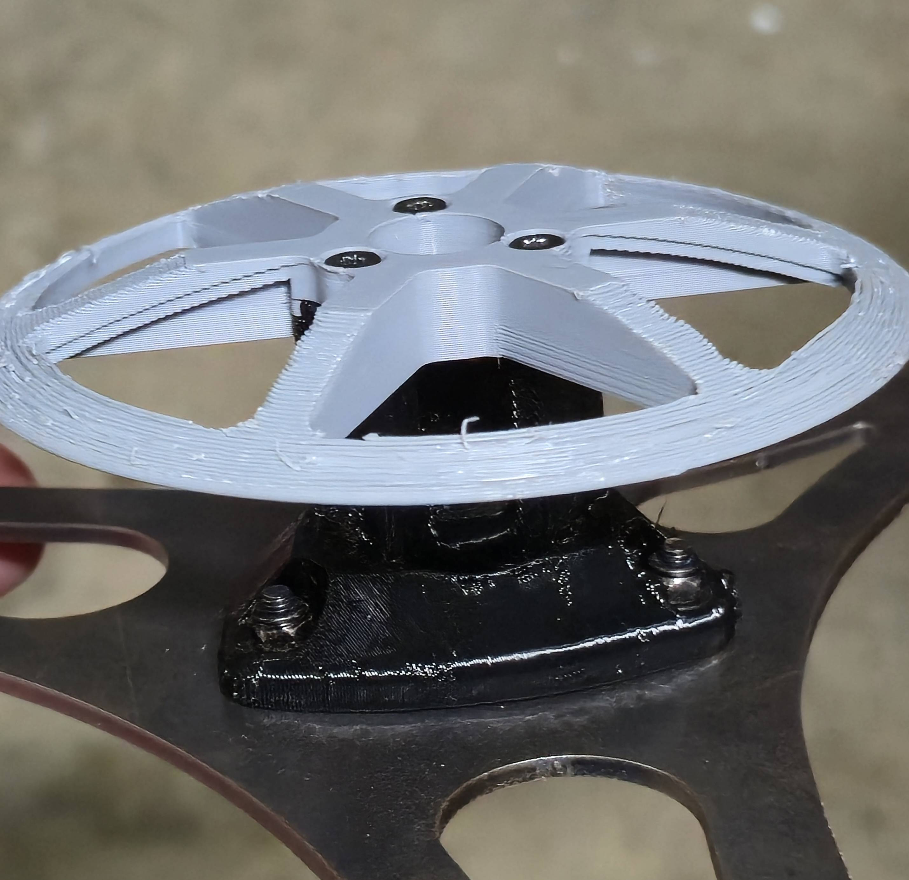
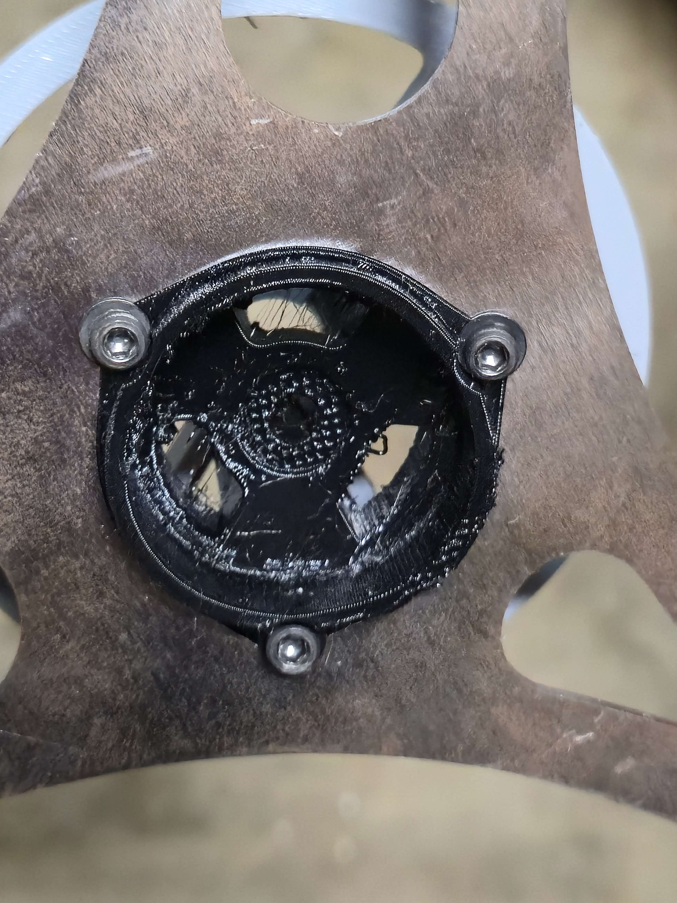
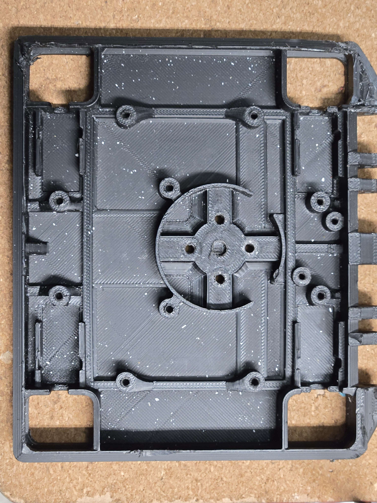
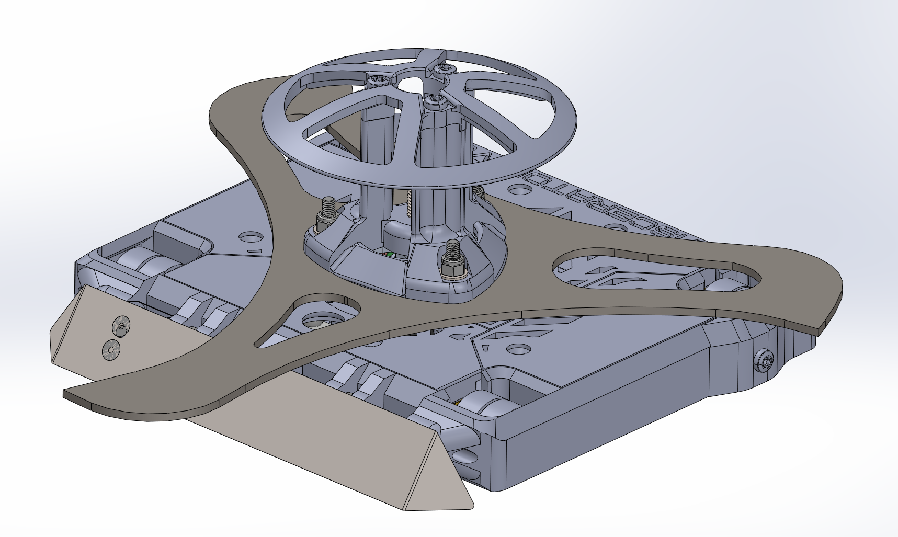
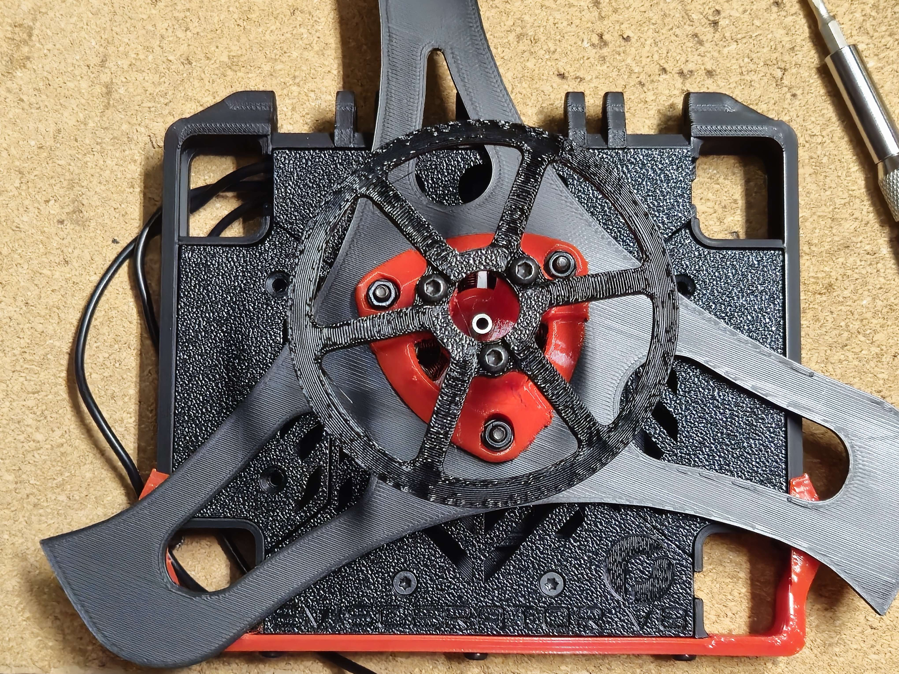
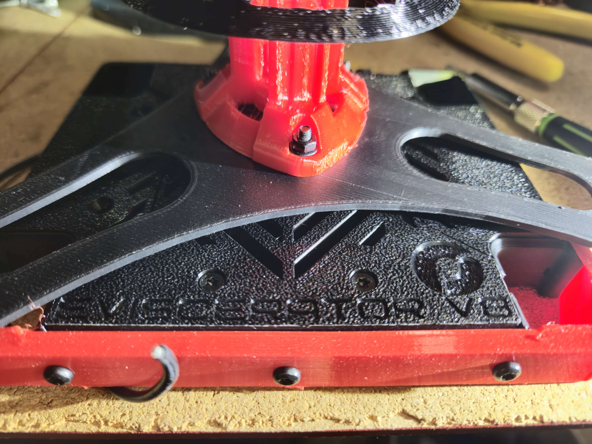
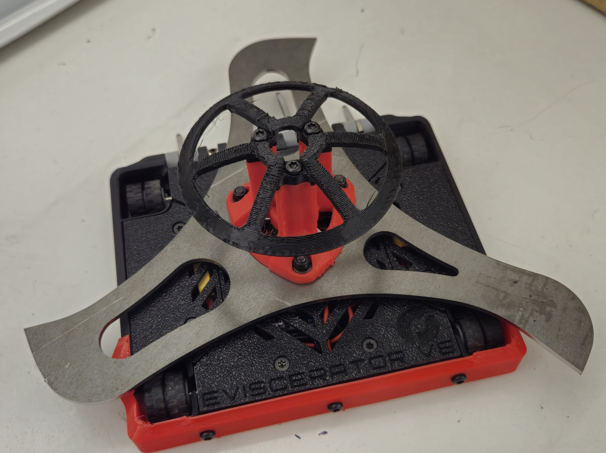
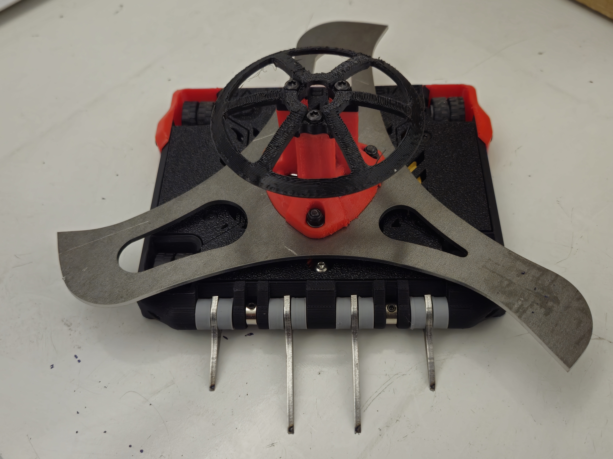

# Eviscerator (Full Combat Antweight)

([back to main page](../README.md))

## Current Version:

My first full combat Antweight based on my Plant (Eviscerator Version 8 ) that also won 1st at last year's TRC. Some changes had to be made moving from Plant to FC Ant for it to actually work.

The main basis of the bot:
- 4WD using 4 N20s
- ~9" dia weapon at ~120g
- Monolithic Polymax chassis
- TPU weapon hub
- Direct Drive weapon motor: battle hardened 1300KV true 2806.5 w/6mm internal shaft (throttle heavily limited as uncapped tip speed >500MPH)
- 4S setup with two 2S lipos in series
- Dome for self-righting

## Plant-to-Ant Upgrades & General Improvements:
- Face mounting the N20s has helped a lot with ground contact as before my top plate that was holding down the drive motors would flex upwards resulting in less than ideal ground contact,
- Weapon hub height reduced to account for lower center of mass,
- Weapon hub changed from solid 98A TPU to 95A TPU to prevent weapon bending,
- Weapon geometry optimized for more consistent bite as one blade is longer than the other two but the MOI ratio remains near perfect at 2.07 (perfect is 2.0),
- Improved thread engagement for motor mounting to prevent thread pullout,
- Switched to Dominion DESCs for better reliability (I killed a lot of Budget DESCs)
---

---

Early Design:

