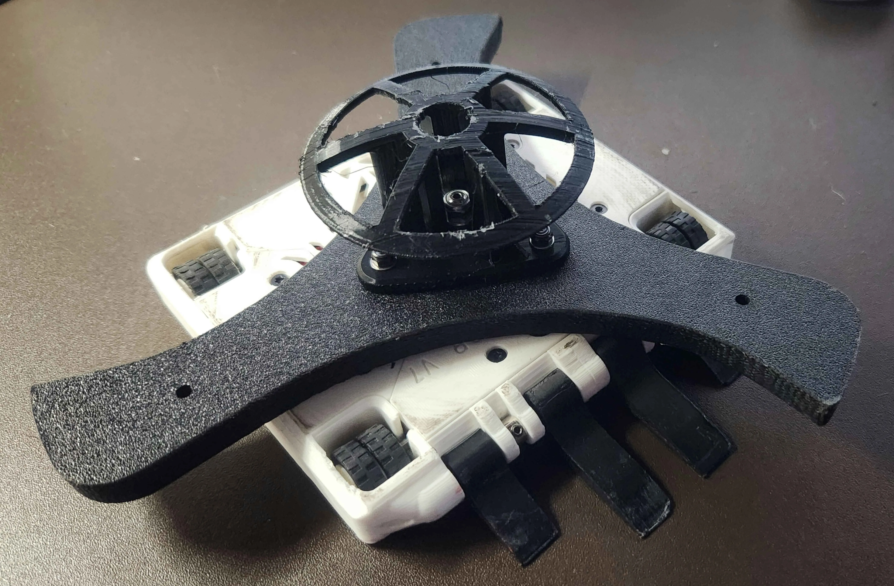

# Competitive Combat Robotics
**Bots:**
---
**1lb Plastic Antweight Division (PLANT):**

- [Eviscerator](Eviscerator/Eviscerator_(PLANT).md) - Won 1st Place @ TRC Texas Cup 2024
  
   <!-- - Videos (youtube): Eviscerator @ TRC Texas Cup 2024 all matches ](https://www.youtube.com/watch?v=gL7ahHKzthY&list=PLaajWfdDszmCy5Lru08SvIwDpJg_W1IqT) -->

  

  
     
    <em>Videos (<a href="https://www.youtube.com/watch?v=Ix6BwbreU1s?list=PLaajWfdDszmCy5Lru08SvIwDpJg_W1IqT">YouTube link</a>):  
  Eviscerator (Black & White Bot) @ TRC Texas Cup 2024 all matches (click image above)</em>
  

- [Oblivion](Oblivion/Oblivion_(PLANT).md)

 **1lb Full Combat Antweight Division (ANT):**

- [EviscerANT](EviscerANT/Eviscerator_(ANT).md) (coming soon)  
  
 **3lb Beetleweight Divion:**
- (coming soon)

---
Built to Follow [SPARC Robot Construction Specifications](https://www.sparc.tools/SPARC_Robot_Construction_Specifications_v1.5.pdf)
---
More info on SPARC guidelines and rules can be found -> [here](https://www.sparc.tools/) <-

---
Eviscerator Version 7
---

Me @ TRC Texas Cup 2024 Receiving First Place Trophy in Plastic Antweight Class:

